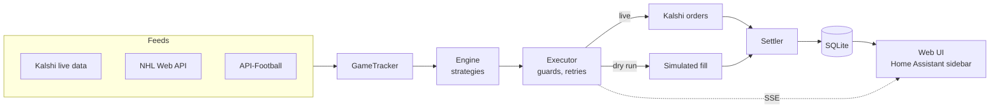
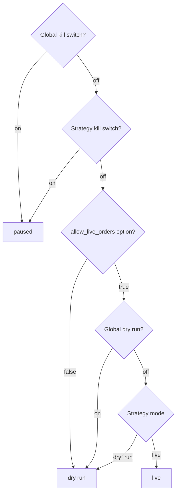

# Kalshi Sports Trader

A Home Assistant app that watches live soccer and NHL games, evaluates in-game strategies and buys the matching
Kalshi contract, either for real (**live**) or as a simulated fill (**dry run**).
[`SPEC.md`](SPEC.md) describes the behaviour and is the source of truth. [`kalshi-trader/DOCS.md`](kalshi-trader/DOCS.md)
is the user guide.

## How it works



Each strategy runs in the first mode that applies:



## Development

You need Node.js 22. [`gitleaks`](https://github.com/gitleaks/gitleaks) is optional: the pre-commit hook uses it
when it is installed, and CI always runs it.

```bash
cd kalshi-trader/app
npm install            # also installs the pre-commit hook
npm run build && npm run dev   # http://localhost:8099, then open /setup once
```

| Command | Purpose |
| --- | --- |
| `npm run dev:web` | UI with hot reload on `:5173` |
| `npm test` / `npm run e2e` | Vitest / Playwright |
| `npm run lint` / `npm run typecheck` | ESLint + Prettier / `tsc` |
| `npm run db:migrate` / `db:generate` | Apply migrations / generate one from `src/db/schema.ts` |
| `npm run audit:security` | Security checks against a production build |
| `npm run verify:image` | Container and packaging checks (needs Docker) |

Configuration comes from environment variables, then a git-ignored `config.local.json` (see
[`config.local.example.json`](kalshi-trader/app/config.local.example.json)). There are no `.env` files.

## Repository

```
SPEC.md            specification
docs/HAOS.md       go-live checklist for Home Assistant OS
docker-compose.yml local run of the production image
kalshi-trader/     the Home Assistant app (config.yaml, Dockerfile, run.sh, DOCS.md)
  app/             Node project: src/, test/, scripts/, migrations/
```
