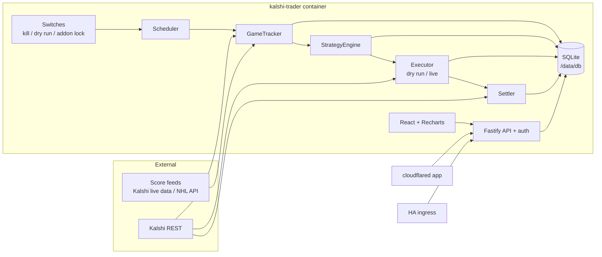
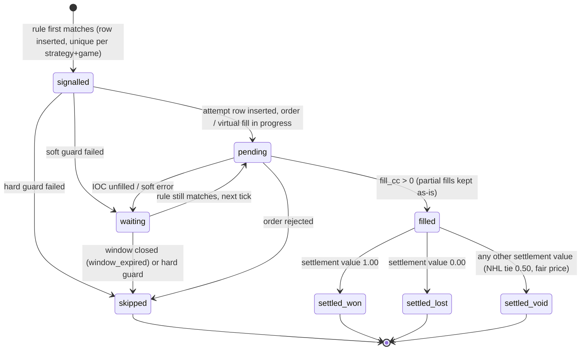

# Kalshi Sports Trading Bot — Specification

Repository: `petrapa6/sports-trading`. Conventions taken from the owner's existing Home Assistant app are recorded in §14 (Reference app facts), so no other repository needs to be read. This file is the single source of truth for the app's behaviour.

### Conventions used everywhere

| Quantity | Representation in code and DB | Example |
| --- | --- | --- |
| Money (stake, cost, fee, payout, P&L, balances, bankroll) | integer **micro-dollars**, column suffix `_micros` (1 = $0.000001) | $0.0052 → `5200` |
| Price | integer **price units of $0.0001**, suffix `_bp` | $0.92 → `9200` |
| Contract count | integer **centi-contracts**, suffix `_cc` (100 = 1 contract) | 2 contracts → `200` |
| Time | ISO-8601 UTC text in SQLite; epoch ms in memory | `2026-09-25T19:04:11.512Z` |
| Mode | `live` or `dry_run` on every trade, log line, stat and chart; backtests are a separate third category `backtest` | — |

Identity that keeps arithmetic exact: `cost_micros = cc × bp`. Kalshi `*_dollars` strings (up to 6 decimals) and `*_fp` counts (2 decimals) are converted with exact decimal-string parsing (`core/decimal.ts`), never through floating point.

## 1. Overview

The app is a single Node.js service, packaged as a Home Assistant app (formerly "add-on") for a Raspberry Pi 5, that watches live soccer and NHL games, evaluates user-defined in-game strategies ("a team leads by N goals at minute M"), and buys the matching contract on Kalshi — either for real (**live**) or as a simulated fill (**dry run**) whose outcome is settled and scored exactly like a real one.

**Working name:** `kalshi-sports-trader` (rename freely).

### What it does

- Polls the score feeds every few seconds while games in the enabled leagues are in progress.
- For each running strategy, checks its trigger against the current game state; enters at most once per strategy per game, retrying within the trigger window when a soft guard (price, depth, stale feed, unfilled order) blocks the first attempt.
- Sizes the order as a percentage of the current Kalshi cash balance (dry run: of a shared virtual bankroll), finds the Kalshi market for that game, and places an immediate-or-cancel limit order (live) or records a virtual fill (dry run).
- Settles every trade when its market settles, records realized P&L, and keeps a full audit log in SQLite under the app's own `/data` so Home Assistant's Google Drive backup captures it.
- Serves a password-protected web UI (login, dashboard with Recharts, strategy editor, trade history with filters, backtesting, settings), reachable from the Home Assistant sidebar (ingress) and through your Cloudflare Tunnel.
- Labels every trade, log line, metric, chart series and export as **live** or **dry run**, and never aggregates the two together.

### What it does not do (v1)

- No pre-game bets, no selling before settlement, no hedging, no multi-leg positions, no top-up of a partially filled entry. One entry per game per strategy, held to settlement.
- No sports other than soccer and hockey; no leagues other than those configured. Adding a league is configuration; adding a sport is code (a small adapter).
- No NHL preseason games by default (per-league setting).
- No push notifications other than Home Assistant persistent notifications (Settings → Notifications).

### Switches and effective mode

Five controls decide whether a strategy trades and how:

| Control | Where it is changed | Default | Effect |
| --- | --- | --- | --- |
| `allow_live_orders` | Home Assistant → the app's **Configuration** tab (add-on option) | `false` | Outer lock. While `false`, no real order can be sent, whatever the web UI says. It cannot be changed from the web UI, so a hijacked web session cannot enable live trading. Changing it restarts the app. |
| **Global kill switch** | Settings → Trading | off | Pauses everything: no outgoing HTTP at all (score feeds, Kalshi reads, orders, discovery, settlement polling). The UI keeps working from the database. Open positions still settle on Kalshi; the settler catches up after the switch is turned off. |
| **Global dry run** | Settings → Trading | **on** | Feeds and Kalshi reads keep running; no real orders; every strategy runs as dry run. |
| **Strategy kill switch** | Strategies page, per strategy | on for new strategies | The strategy is not evaluated and places nothing. Its open trades still settle (feeds and settlement are shared). Replaces the former `enabled` flag. |
| **Strategy mode** | Strategies page, per strategy | `dry_run` | `dry_run` or `live`. |

Effective mode, computed in `core/modes.ts` on every evaluation and again before every order attempt (switches are read from the DB each time, never cached):

```
if global_kill_switch            → paused   (scheduler idle, zero outgoing HTTP)
else if strategy.kill_switch     → paused   (strategy skipped; its settlements continue)
else if !allow_live_orders       → dry_run  (mode_reason = 'addon_lock')
else if global_dry_run           → dry_run  (mode_reason = 'global_dry_run')
else if strategy.mode == dry_run → dry_run  (mode_reason = 'strategy')
else                             → live     (mode_reason = null)
```

Every trade stores `configured_mode` (the strategy's own setting), `effective_mode` and `mode_reason`, so a strategy configured live but running as dry run is visible as "live → dry run (global)". Re-entering the password (step-up, §10) is required for every change that can lead to real orders: turning the global kill switch off, turning global dry run off, turning a strategy kill switch off, and switching a strategy to `live`. Changes towards safety (switching anything on, switching to dry run) need no step-up.

### One code path

Dry run and live share the entire pipeline — feed, strategy evaluation, market lookup, guards, sizing, limit-price computation, settlement, reporting. The only branch is the final `placeOrder` call: a Kalshi IOC order in live, a virtual fill against the same orderbook in dry run.

## 2. How Kalshi works for this app

Kalshi is a CFTC-regulated exchange where every market is a binary Yes/No contract priced between $0 and $1; at settlement a winning contract pays $1.00. The price is the market's implied probability. Sports game markets stay open **during the game** (in-play trading), which is what makes the "leading at minute M" strategy possible.

### Market structure for our two sports (confirmed against the production API on 2026-09-25)

| Sport | League | Series ticker | Markets per game | Settles on |
| --- | --- | --- | --- | --- |
| Hockey | NHL | `KXNHLGAME` | 2 (home / away), mutually exclusive | Official final result including OT/shootout. Market rules: tie → every market settles at $0.50; game postponed but started within 48 h → stays open; cancelled or not started within 48 h → "fair price". The series also lists preseason games (`product_metadata.competition = "Pro Hockey Preseason"`), excluded by default. Example event `KXNHLGAME-26SEP24UTAVGK`. |
| Soccer | English Premier League | `KXEPLGAME` | 3 (home / tie / away) | 90 minutes plus stoppage time (no extra time or penalties). Example event `KXEPLGAME-26FEB07WOLCFC`. |
| Soccer | La Liga | `KXLALIGAGAME` | 3 | 90' + stoppage |
| Soccer | Bundesliga | `KXBUNDESLIGAGAME` | 3 | 90' + stoppage |
| Soccer | Serie A | `KXSERIEAGAME` | 3 | 90' + stoppage |
| Soccer | Ligue 1 | `KXLIGUE1GAME` | 3 | 90' + stoppage |

All six series report `fee_type: quadratic_with_maker_fees`, `fee_multiplier: 1`. The app never hard-codes event or market tickers: series tickers live in the `leagues` table; events come from `GET /events`; each market is mapped to a team through its `custom_strike` (e.g. `{"hockey_team": "<structured-target uuid>"}`) and `yes_sub_title`, or to `tie`.

Relevant market fields (observed on a settled NHL market):

- `status` moves through `unopened → open → closed → settled / finalized`. `can_close_early: true` — the market closes as soon as a winner is declared.
- `result` (`yes` / `no`) and **`settlement_value_dollars`** (`1.0000`, `0.0000`, `0.5000` for an NHL tie, or a fair-price value). Payout is always computed from `settlement_value_dollars`, never from `result` alone.
- `price_level_structure` and **`price_ranges`** (`[{start, end, step}]`): the valid price grid. NHL game markets currently use `linear_cent` ($0.01 steps), but some structures use sub-cent steps between $0.90 and $1.00 — exactly where this strategy trades — so limit prices are always snapped to the market's own `price_ranges`.
- The milestone (game) is **not** on the event; it is found with `GET /milestones?related_event_ticker=<event>` (§3).

### The trade the strategy makes

"Team X leads by N goals at minute M" → **buy YES on the market "X wins"** (Create Order V2: `side: "bid"` means buy YES). Late in a game that contract typically trades at $0.85–$0.98, so the position risks the whole stake to win a few cents per contract. Expected value depends entirely on how often the lead actually holds versus what the price implies — which is what dry run and backtesting measure.

- Limit price: `limit_bp = min(best_ask_bp + maxSlippage_bp, maxPrice_bp)`, snapped **down** to the market's price grid.
- Contracts (whole contracts in v1): `contracts = floor(stake_micros / (limit_bp × 100))`, sent as `count`.
- Fills can still be fractional (0.01-contract granularity) because resting orders from other users can be fractional; fills are stored in centi-contracts.
- Payout = `fill_cc × settlement_value_bp`; profit if the lead holds = payout − cost − fee.

### Fees

Taker fee per order (Kalshi fee schedule, effective 7 Jul 2026; fee-rounding guide):

```
model fee ($) = M × 0.07 × C × P × (1 − P)        C = contracts, P = price in $, M = series multiplier
```

Rounding: the model fee is rounded up to $0.000001, then the fee is increased so that **position cost + fee** lands on the account's balance precision — $0.0001 for direct members (Kalshi calls this rounding to a "centicent"). Integer implementation (`core/pricing.ts`):

```
raw_micros   = ceil( 7 × M × cc × bp × (10000 − bp) / 1_000_000 )
cost_micros  = cc × bp
fee_micros   = ceil( (cost_micros + raw_micros) / PREC ) × PREC − cost_micros      PREC = fee_balance_precision_micros
```

`PREC` is a setting, default `100` ($0.0001). Kalshi's own fee table still shows whole-cent fees (e.g. $0.01 for one contract at $0.92), so the setting can be raised to `10000` for conservative dry runs; compare the first demo/prod fills against the formula to confirm which precision applies. Examples with `PREC = 100`: 1 contract at $0.92 → $0.0052; 2 at $0.94 → $0.0079; 100 at $0.50 → $1.75. Maker fees do not apply (orders are IOC, never resting). No settlement fee. Series multiplier from `GET /series/{ticker}` (`fee_multiplier`), with per-event overrides from `GET /events/{ticker}` when present.

In live mode the fee is taken from the exchange: Create Order V2 returns **`average_fee_paid` per contract**, so `fee = average_fee_paid × fill_count` (exact decimal multiplication).

### API essentials

| Item | Value |
| --- | --- |
| Base URL (prod) | `https://external-api.kalshi.com/trade-api/v2` (also `https://api.elections.kalshi.com/trade-api/v2`) |
| Base URL (demo) | `https://external-api.demo.kalshi.co/trade-api/v2` (also `https://demo-api.kalshi.co/trade-api/v2`) — paper money, used for all development |
| Auth | Headers `KALSHI-ACCESS-KEY` (key id), `KALSHI-ACCESS-TIMESTAMP` (ms), `KALSHI-ACCESS-SIGNATURE` = base64 RSA-PSS/SHA-256 over `timestamp + METHOD + path` (path without query string). Node: `crypto.sign('sha256', msg, {key, padding: RSA_PKCS1_PSS_PADDING, saltLength: RSA_PSS_SALTLEN_DIGEST})`. Kalshi also accepts Ed25519 keys; v1 supports RSA only. |
| Balance | `GET /portfolio/balance?subaccount=<n>` — prefer `*_dollars` fields when present |
| Order book | `GET /markets/{ticker}/orderbook` → YES bids and NO bids only; YES ask levels are derived as `1 − NO bid` with the NO bid's size |
| Market | `GET /markets/{ticker}`; after the historical cutoff `GET /historical/markets/{ticker}` |
| Place order | `POST /portfolio/events/orders` (Create Order V2, returns `201`): `{ticker, side:"bid", count:"2", price:"0.9400", time_in_force:"immediate_or_cancel", self_trade_prevention_type:"taker_at_cross", client_order_id, order_group_id, subaccount}` (`subaccount` omitted when 0; `exchange_index` omitted → auto-routed). Response: `order_id`, `client_order_id`, `fill_count`, `remaining_count`, `average_fill_price` and `average_fee_paid` (both only when `fill_count > 0`), `ts_ms`. The legacy `/portfolio/orders` create endpoint is deprecated. |
| Order lookup | `GET /portfolio/orders?ticker=&min_ts=&status=` (**no `client_order_id` filter** — the app filters by ticker and time and matches `client_order_id` itself); orders older than the cutoff via `GET /historical/orders`. Order objects carry `fill_count_fp`, `taker_fill_cost_dollars`, `taker_fees_dollars`, `yes_price_dollars`. |
| Positions / fills / settlements | `GET /portfolio/positions`, `/portfolio/fills`, `/portfolio/settlements` (and `/historical/fills`) — reconciliation of live trades |
| Order groups | `POST /portfolio/order_groups/create`, `GET /portfolio/order_groups/{id}`, `PUT /portfolio/order_groups/{id}/reset` (subaccounts need the Advanced tier: `POST /account/api_usage_level/upgrade`) — an exchange-enforced cap on contracts matched in a rolling 15-second window; every live order carries the app's `order_group_id` (§10) |
| Subaccounts | Numbered subaccounts (1–63) with API keys restricted to one subaccount; available from the Advanced API tier, which any account gets with one call to the upgrade endpoint once one of its last 100 orders was placed via the API (§10) |
| Milestones | `GET /milestones?related_event_ticker=<event>` → `id`, `start_date`, `details` (team ids), `source_ids` (e.g. Sportradar id) |
| Live game data | `GET /live_data/milestone/{milestone_id}` and the batch endpoint `GET /live_data/batch?milestone_ids=a,b` (response `live_datas`) → `details.home_points`, `away_points`, `status` (`none`/`live`/`finished`), `round`, `final_round_time_left`, `tileLiveText`, `widgetLiveText`, `home_id`/`away_id`, soccer `home_significant_events`/`away_significant_events`. `details` is an open object — validate at runtime. |
| Game play-by-play | `GET /live_data/milestone/{milestone_id}/game_stats` → `pbp.periods[].events[]` (soccer and pro hockey supported) — candidate free source of goal timelines for Kalshi-era games (§3) |
| Candlesticks | `GET /series/{series_ticker}/markets/{ticker}/candlesticks?start_ts&end_ts&period_interval=1` → per minute `yes_ask`, `yes_bid` (OHLC, `*_dollars`), `price` (trade OHLC, nullable), `volume_fp`; settled before the cutoff: `GET /historical/markets/{ticker}/candlesticks` |
| Historical cutoff | `GET /historical/cutoff` → `market_settled_ts`, `trades_created_ts`, `orders_updated_ts`, `market_positions_last_updated_ts` (each data type has its own cutoff) |
| Exchange status | `GET /exchange/status` (`trading_active`, `exchange_active`), `GET /exchange/schedule` |
| Maintenance | Every **Thursday 03:00–05:00 ET** a trading pause (no new orders); rare unscheduled exchange pauses |
| Rate limit (Basic tier) | Read 200 tokens/s (bucket holds 3 s), write 100 tokens/s (bucket holds 1 s); default cost 10 tokens/request (`GET /account/endpoint_costs` lists exceptions) → 20 reads/s sustained. `429` carries no `Retry-After`; back off exponentially. |
| SDK | The official `kalshi-typescript` SDK lags the API; the app uses a hand-written client (`feeds/kalshi/client.ts`) whose responses are validated by Zod schemas (`feeds/kalshi/schemas.ts`) written from the API documentation and recorded payloads, which also keeps the dependency surface small |
| Docs | https://docs.kalshi.com/llms.txt (index) |

Day-one check in the demo environment: whether demo lists live sports milestones with real-time scores. If demo live data is sparse, dry-run validation runs against **production read endpoints** with orders disabled (`allow_live_orders: false`), which is safe because reads cannot move money.

## 3. Data sources

The app needs **live game state** (score, minute/period, status) to fire strategies, **Kalshi market discovery** to know which contract to buy, and **historical goal timelines plus historical prices** for backtesting. Every feed sits behind a small adapter interface. While the global kill switch is on, no adapter makes any request.

### Live game state — `ScoreFeed` interface

```typescript
interface GameState {
  gameId: string;               // internal id = Kalshi event ticker
  leagueId: string;
  homeTeam: string; awayTeam: string;
  homeScore: number; awayScore: number;
  phase: 'scheduled' | 'live' | 'halftime' | 'intermission' | 'finished' | 'postponed';
  clock: {
    minute?: number;            // soccer match minute (stoppage counts as 45 / 90); hockey elapsed minute 0–60
    minuteSource?: 'feed' | 'derived';
    period?: number; secondsLeftInPeriod?: number;
    regulationOver: boolean;
  };
  source: string;               // adapter id
  observedAt: Date;             // when this app received it
  feedUpdatedAt?: Date;         // timestamp reported by the feed, if any
}
interface ScoreFeed {
  id: FeedId; sports: readonly Sport[];
  poll(games: readonly TrackedGame[]): Promise<FeedObservation[]>;   // one call per tick for all tracked games
  listLive(leagueId: string): Promise<GameState[]>; get(gameId: string): Promise<GameState>;
  test(games: readonly TrackedGame[]): Promise<string>;               // Settings → Feeds "Test"
}
```

| Adapter | Sport | Default | What it gives | Notes |
| --- | --- | --- | --- | --- |
| `kalshi-live` | both | **on** (primary) | One batch live-data call per tick for all tracked milestones: `home_points`, `away_points`, `status`, `round`, `final_round_time_left`, `tileLiveText`/`widgetLiveText`, team ids that map straight to market structured targets | Zero extra keys, no team-name matching, and it is the state Kalshi settles on. Soccer minute is not a first-class field: parsed from `tileLiveText`/`widgetLiveText` (`78'`, `45+2'`, `HT`, `FT`); if unparseable, derived (below). |
| `nhl-official` | hockey | **on** (cross-check) | `https://api-web.nhle.com/v1/score/now` → `period`, `clock.timeRemaining`, `homeTeam.score`, `gameState` (`FUT`, `PRE`, `LIVE`, `CRIT`, `FINAL`, `OFF`) | Authoritative clock for NHL; matched to games via tricodes, `teams.aliases` and milestone `source_ids` |
| `api-football` | soccer | **off** (opt-in) | `GET /fixtures?live=all` → `fixture.status.elapsed`, goals, status codes | Key stored encrypted (Settings → Feeds); a daily request quota guard (default 100) stops it before the plan's limit; a paid plan is needed for 5-second-class polling. When fresh, its minute is the soccer clock |

**Soccer minute fallback (derived).** When the Kalshi text cannot be parsed, the tracker derives the minute from wall-clock time since the observed kick-off (first transition to `live`) and since the observed start of the second half (first `live` after halftime), minute = whole minutes elapsed (floored), capped at 45 and 90 respectively; `minuteSource = 'derived'` is stored on every snapshot and shown in the trade snapshot. Accuracy is about ±1 minute on replays.

**Halftime / intermission.** Kalshi `status` has no break state. Soccer halftime = text `HT` or `round` change without play; hockey intermission = `final_round_time_left` `00:00` with `round` 1 or 2, or NHL `clock.inIntermission`. Strategies never fire during a break.

**Polling plan.** The scheduler polls at **5 s** while any tracked game is live, **60 s** during the hour before a scheduled game, and stops otherwise; the global kill switch puts it in `paused` (zero requests). With two feeds for a game (NHL, or soccer with API-Football switched on), the `GameTracker` reconciles them: score = the agreed value; a disagreement lasting more than 20 s sets `games.blocked = 1`, is logged, and blocks entries for that game until the feeds agree again. Team matching between feeds uses the `teams` table seeded from Kalshi structured targets.

### Kalshi market discovery

At start-up and daily at 05:00 local time, for each enabled league:

1. `GET /events?series_ticker={series}&status=open&with_nested_markets=true` (cursor pagination).
2. Skip events whose `product_metadata.competition` contains `Preseason` unless the league's `include_preseason = 1`; store `competition` on the game.
3. For each event: `GET /milestones?related_event_ticker={event}` → `milestone_id`, `start_date` (scheduled kick-off), home/away team ids, `source_ids`.
4. Upsert `games` (event ticker, teams, `scheduled_at`, `milestone_id`, competition) and `markets` (ticker, outcome `home`/`away`/`tie`, status, `price_ranges`). A market whose target cannot be mapped is stored with `outcome = 'unknown'` and a `warn` log; it is never traded.

Just before an order attempt, the executor re-reads the exact market (`GET /markets/{ticker}`) and its orderbook.

**Backfill discovery** (Settings → Data): the same walk with `status=settled` over a chosen date range, so that past-season Kalshi games (roughly 2025–26 onward) can be imported for exact backtests even though the app never saw them live.

### Historical data for backtesting

Backtesting "lead at minute M" needs **goal timestamps** and the **ask at the trigger minute**. v1 uses free sources only.

| Need | Source | Coverage | Notes |
| --- | --- | --- | --- |
| NHL goal timelines | NHL Web API `GET /v1/schedule/{date}` + `GET /v1/gamecenter/{gameId}/play-by-play` | All seasons, free, no key | Goal events carry period and time; ~1,312 regular-season games per season; preseason skipped by default |
| Soccer and NHL goal timelines for Kalshi-listed games | Kalshi `game_stats` play-by-play per milestone | Games Kalshi listed with a Sportradar id | Verified on production payloads (2026-09-26): usable for both sports — every event carries the running `home_points` / `away_points`; soccer events have the match `clock` (`62:25`, `90+1`) and `match_time`, hockey events the time remaining in the period. Imported by the Kalshi backfill (`source = 'kalshi_pbp'`) |
| Goal timelines of games the app tracked live | The app's own `game_snapshots`, archived into `hist_games` (`source = 'live'`) when a game finishes | From the day the app runs | Guarantees the price model and exact backtests survive snapshot pruning |
| Soccer, older seasons | Generic CSV importer (e.g. Kaggle "European Soccer Database", 2008–2016) | Whatever the user uploads | Modelled prices only (no Kalshi candles exist for those games) |
| Kalshi in-play prices | Candlesticks, 1-minute (`yes_ask` and `yes_bid` OHLC) | Since Kalshi listed each series (NHL and EPL game markets from roughly the 2025–26 season) | Exact backtests use the **ask close** at minute M |
| Prices before Kalshi existed | **Price model** fitted on collected candles: median ask by (sport, lead, minutes remaining) | Any season | Labelled "modelled" in the UI (§9) |
| Soccer, bulk paid import | API-Football (`/fixtures`, `/fixtures/events`) | 1,200+ leagues | Settings → Data, one league and season per job (needs a paid key; `source = 'api_football'`) |

**Generic CSV importer** (Settings → Data): columns `league_code, season, date, home, away, home_goals_final, away_goals_final, goal_events` where `goal_events` is `home:23;away:67;home:90+2`. Any dataset the user can shape into this form becomes backtestable (modelled prices).

## 4. Architecture

One Node.js process (TypeScript, ESM) runs an HTTP server and a background trading loop; the UI is a React single-page app served from the same process. No message broker, no second container: the Pi 5 has plenty of headroom and a single process keeps the security surface small.


```mermaid
flowchart LR
  subgraph feeds[External]
    K[Kalshi REST]
    S[Score feeds<br/>Kalshi live data / NHL API]
  end
  subgraph app[kalshi-trader container]
    SW[Switches<br/>kill / dry run / addon lock] --> SCH
    SCH[Scheduler] --> GT[GameTracker]
    GT --> SE[StrategyEngine]
    SE --> EX[Executor<br/>dry run / live]
    EX --> ST[Settler]
    GT & SE & EX & ST --> DB[(SQLite<br/>/data/db)]
    API[Fastify API + auth] --> DB
    UI[React + Recharts] --> API
  end
  K --> GT & EX & ST
  S --> GT
  CF[cloudflared app] --> API
  ING[HA ingress] --> API
```

The scheduler wakes the tracker; the tracker turns feed data into `GameState`; the engine matches states against strategies and emits signals; the executor turns a signal into a virtual or real fill (or a skip); the settler closes trades when markets settle. Everything writes to SQLite; the UI reads SQLite plus a small live-status stream.

### Stack

| Layer | Choice | Reason |
| --- | --- | --- |
| Runtime | Node.js ≥ 22 (local dev: Node 22 LTS; container: the `nodejs` package of the pinned Home Assistant base image, which must be ≥ 22), TypeScript, ESM | Native `fetch`, `crypto.sign` for RSA-PSS, `process` APIs; same Node build for compile and run inside the container |
| HTTP | Fastify 5 + `@fastify/helmet`, `@fastify/rate-limit`, `@fastify/cookie`, `@fastify/csrf-protection`, `@fastify/static` | Schema-validated routes, mature security plugins; sessions are implemented in-house on the `sessions` table |
| DB | SQLite via `better-sqlite3` (WAL mode) + Drizzle ORM for typed schema and migrations | Synchronous, single file, trivially backed up |
| UI | React 19 + Vite, TanStack Query, TanStack Table, **Recharts** for every chart | TanStack Table gives the filtering/sorting the trades page needs |
| Validation | Zod for strategy JSON, API bodies and every external payload | Feed payloads are untrusted input |
| Numbers | `core/decimal.ts`: exact parsing of `*_dollars` / `*_fp` strings into integers | No floating point in money paths |
| Scheduling | In-process loop with `setTimeout` chains | One interval per state (live / pre-game / idle / paused) |
| Logging | Pino JSON to stdout (HA log tab) + `audit_log` table for anything money- or security-related | Every trading-related line carries `mode` (§8) |
| Tests | Vitest, `msw`, Playwright, recorded fixtures of real Kalshi/NHL payloads | Deterministic tests without network |

### Module map

```
kalshi-trader/app/src/
  server/        Fastify app, request classes, auth, routes (REST + SSE)
  core/
    decimal.ts       exact string ↔ integer conversions
    modes.ts         effective mode from the five switches (pure, table-tested)
    scheduler.ts     poll cadence; paused state for the global kill switch
    tracker.ts       merges feeds → GameState, detects phase changes, archives finished timelines
    engine.ts        evaluates strategies, window + once-per-game logic
    guards.ts        hard/soft guard evaluation (shared with the backtester)
    executor.ts      sizing, limit price, dry-run fill or Kalshi order, attempts
    settler.ts       closes trades on settlement, reconciles live positions
    pricing.ts       fee, cost, P&L math (pure, integer)
    maintenance.ts   WAL checkpoint, snapshot pruning
  feeds/
    kalshi/        client (signing, token buckets, backoff), discovery, live data
    network.ts     network gate (global kill switch → no outgoing request), used by every client and feed
    nhl/           NHL Web API adapter
    apiFootball/   API-Football adapter
  backtest/      importers, candle collector, simulator (worker), price model
  db/            drizzle schema, migrations, repositories
  web/           React app
```

### Live status without polling the UI

`GET /api/live` (Server-Sent Events) pushes the switch states, tracked games with their current state, strategies with their **effective mode badge**, recent signals, and the last 50 log lines (each tagged with its `mode`). SSE works through Cloudflare Tunnel and HA ingress without special configuration.

### Concurrency and safety invariants

- One trading loop; feed polls run concurrently with `Promise.allSettled`, strategy evaluation and order attempts run serially.
- **Once per game per strategy:** `UNIQUE(strategy_id, game_id)` on `trades`. The row is inserted when the rule first matches (status `signalled`), before any orderbook read or order.
- **Every order attempt** (live or virtual) first inserts a `trade_attempts` row with status `pending` and a fresh unique `client_order_id` (`<trade.id>-<attempt_no>`), **then** calls Kalshi, then updates the row. A crash mid-order therefore always leaves a findable record.
- **Restart recovery** runs before the scheduler starts: for each `pending` live attempt, `GET /portfolio/orders?ticker=<market>&min_ts=<attempt time − 60 s>` (then always `/historical/orders` when that has no match), match on `client_order_id`, apply the outcome; not found in either → `unfilled` with reason `restart_no_order`; a lookup that fails leaves the attempt `pending` for the settler loop to resolve. Pending dry-run attempts are marked `unfilled` (`restart`).
- Switches are read from the DB on every evaluation and before every attempt; `allow_live_orders` comes from the process configuration (changing it restarts the app).
- **Global kill switch:** the Kalshi client and every feed adapter call a single `assertNetworkAllowed()` gate before any request; while the switch is on the gate rejects, the scheduler is `paused`, and in-flight requests are allowed to finish.
- The dry-run bankroll is updated inside the same SQLite transaction as the trade state change, so concurrent fills cannot lose an update.

## 5. Strategy model

A strategy is a row with a JSON `rule`; the engine evaluates the rule against every live `GameState` in the strategy's leagues. v1 ships one rule type, `lead_at_time`; the schema is versioned so more types can be added without migrating existing rows.

```json
{
  "name": "EPL 2-goal lead at 80'",
  "sport": "soccer",
  "leagueIds": ["epl", "laliga"],
  "mode": "dry_run",
  "killSwitch": true,
  "rule": {
    "type": "lead_at_time",
    "version": 1,
    "minLead": 2,
    "atMinute": 80,
    "windowMinutes": 5,
    "leaderSide": "any",
    "maxOpponentGoals": 0,
    "underdogOnly": false
  },
  "sizing": { "type": "percent_of_balance", "percent": 2, "minStakeUsd": 1, "maxStakeUsd": 50 },
  "execution": {
    "orderType": "ioc_limit",
    "maxPrice": 0.97,
    "minPrice": null,
    "maxSlippage": 0.01,
    "minDepthContracts": 20,
    "maxFeedAgeSec": 15
  }
}
```

New strategies are created with `killSwitch: true` (paused) and `mode: "dry_run"`.

### Rule: `lead_at_time`

| Field | Meaning | Soccer | Hockey |
| --- | --- | --- | --- |
| `minLead` | Leader's goal margin must be ≥ this; integer ≥ 1 | goals | goals |
| `atMinute` | Earliest clock minute at which the strategy may enter | match minute 1–90 (stoppage counts as 45 / 90) | elapsed minute 1–59 = (period − 1) × 20 + (20 − time left), floored |
| `windowMinutes` | Entry window: the strategy may enter while `atMinute ≤ minute ≤ atMinute + windowMinutes` | default 5 | default 3 |
| `leaderSide` | `any`, `home`, or `away` | | |
| `maxOpponentGoals` | Optional: the trailing team has scored at most this many goals; integer ≥ 0, omitted = no limit | goals | goals |
| `underdogOnly` | Optional, default `false`: only when the leader was the pre-game underdog — its YES ask at kick-off (`games.pregame_home_bp` / `pregame_away_bp`) strictly below the opponent's; unknown kick-off asks never match | | |

The rule **matches** when `phase === 'live'`, the game is not `blocked`, `|home − away| ≥ minLead` with the leader on an allowed side, the extra conditions above hold, and the minute is inside the window.

**Kick-off asks.** On every `scheduled → live` change the YES ask of the home and away markets is read (`GET /markets/{ticker}`, through the network gate) and written once to `games.pregame_*_bp`; when Kalshi cannot be asked, the last ask stored in `markets.yes_ask_bp` is used. The backtester uses these values when recorded, otherwise in exact mode the candle at the scheduled start; modelled backtests have no kick-off prices, so an `underdogOnly` rule never trades there. It never matches during halftime/intermission or after regulation (hockey OT is excluded; soccer stoppage time of the second half counts as minute 90).

**First match** inserts the `trades` row (`signalled`) with the trigger snapshot (score, minute, minute source, feed timestamps), the leader's market, `configured_mode`, `effective_mode`, `window_ends_at`. Then the executor makes an attempt.

**Retry within the window.** If an attempt is blocked by a *soft* guard (table below) the trade goes to `waiting` with `skip_reason` = that guard, and on every later tick while the rule still matches and the window is open the executor tries again (new `trade_attempts` row each time). If the leader changes or the lead drops below `minLead`, no attempt is made on that tick. When the window closes without a fill, the trade becomes `skipped` with the last soft reason and `window_expired = 1`. A *hard* guard ends the trade immediately as `skipped`. A partial fill ends the entry (no top-up in v1).

### Sizing: `percent_of_balance`

- **Live:** balance = Kalshi cash for the configured subaccount (`GET /portfolio/balance`) at the attempt, minus the cost of this app's live attempts still `pending`.
- **Dry run:** one **shared virtual bankroll** for all dry-run trades (Settings, default $100, editable, resettable with step-up), debited by cost + fee at the virtual fill and credited with the payout at settlement, so it compounds like a real account. Per-strategy equity curves are derived from each strategy's own trades.
- `stake_micros = clamp(balance × percent / 100, minStakeUsd, maxStakeUsd)` (converted to micros); `limit_bp` as in §2; `contracts = floor(stake_micros / (limit_bp × 100))`; if `contracts < 1` → hard skip `too_small`.

### Guards (identical in live, dry run and backtest; evaluated in this order)

| # | Guard | Class | Skip reason |
| --- | --- | --- | --- |
| 1 | Effective mode is `paused` (a kill switch was turned on mid-window) | hard | `paused` |
| 2 | Market `status` is `open` (or `active`) and `close_time` (when known) in the future | hard | `market_closed` |
| 3 | Exchange `trading_active` (`GET /exchange/status`) | soft | `exchange_paused` |
| 4 | Newest feed observation for the game is at most `maxFeedAgeSec` old | soft | `stale_feed` |
| 5 | Game not `blocked` by feed disagreement | soft | `feed_blocked` |
| 6 | Best YES ask ≤ `maxPrice` | soft | `price` |
| 7 | Best YES ask ≥ `minPrice` (optional; a very cheap ask for a "leading" team usually means the score just changed and the feed is behind) | soft | `min_price` |
| 8 | Contracts available at prices ≤ `limit_bp` ≥ `minDepthContracts` | soft | `liquidity` |
| 9 | Sizing yields ≥ 1 contract | hard | `too_small` |
| 10 | Live only: IOC order filled nothing | soft | `unfilled` |
| 11 | Live only: exchange rejected the order because the order group limit was hit | soft | `order_group_limit` |
| 12 | Live only: exchange rejected the order (4xx other than rate limit) | hard | `order_rejected` |
| 13 | Transient error (network, 5xx, 429 after backoff) | soft | `error` |

Other reasons written by the executor outside the guard chain: `no_market` (no market for the leading side), `window_expired` (the window closed with no earlier soft reason; `trades.window_expired = 1` either way), `restart` / `restart_no_order` / `order_not_found` (restart recovery, §4) and `mode_changed` (the effective mode left `live` between the reads and the order).

There is no daily loss limit or trades-per-day cap in v1. The safety controls are the switches (§1), per-strategy `maxStakeUsd`, the order group and the dedicated subaccount (§10).

### Modes and lifecycle

`mode ∈ {dry_run, live}` and `kill_switch ∈ {0, 1}` per strategy; the effective mode follows §1. Editing a strategy's rule, sizing, execution or leagues creates a new `strategy_versions` row; trades reference the version they fired under, so changing `minLead` later never rewrites history. Toggling mode or kill switch does not create a version (they are recorded in `audit_log`). Deleting a strategy soft-deletes it (`deleted_at`) so its trades remain in reports.

## 6. Trade lifecycle and P&L

A trade moves through the same states in both modes; only the fill step differs.


```mermaid
stateDiagram-v2
  [*] --> signalled : rule first matches (row inserted, unique per strategy+game)
  signalled --> pending : attempt row inserted, order / virtual fill in progress
  signalled --> waiting : soft guard failed
  signalled --> skipped : hard guard failed
  waiting --> pending : rule still matches, next tick
  waiting --> skipped : window closed (window_expired) or hard guard
  pending --> filled : fill_cc > 0 (partial fills kept as-is)
  pending --> waiting : IOC unfilled / soft error
  pending --> skipped : order rejected
  filled --> settled_won : settlement value 1.00
  filled --> settled_lost : settlement value 0.00
  filled --> settled_void : any other settlement value (NHL tie 0.50, fair price)
  skipped --> [*]
  settled_won --> [*]
  settled_lost --> [*]
  settled_void --> [*]
```

### Filling

| Step | Dry run | Live |
| --- | --- | --- |
| Price | `limit_bp = min(best_ask + maxSlippage, maxPrice)`, snapped to the market's price grid | Same, sent as the IOC `price` |
| Contracts | `floor(stake / limit)`, capped by the contracts offered at prices ≤ `limit_bp` | Same, sent as `count` |
| Fill | Recorded immediately at the **limit price** for all contracts (worst case the live order could get) | `POST /portfolio/events/orders`, `immediate_or_cancel`, with `client_order_id`, `order_group_id`, `subaccount`; stores `fill_count`, `average_fill_price`, fee = `average_fee_paid × fill_count` |
| Fee | Fee formula (§2) with the series multiplier and `fee_balance_precision_micros` | From the response |
| Bankroll | Shared virtual bankroll debited by cost + fee | Kalshi balance (read back into `balance_snapshots`) |

Because dry run assumes the limit price and live usually fills at or below it, dry-run results are slightly conservative; the Trades page shows the ask at trigger next to the fill price in both modes.

### Settling

The settler runs every 60 s (not while the global kill switch is on) for trades in `filled`:

1. `GET /markets/{ticker}` (or `/historical/markets/{ticker}` once past `market_settled_ts`). When `status ∈ {settled, finalized}` and `settlement_value_dollars` is present → `settlement_value_bp`.
2. `payout_micros = fill_cc × settlement_value_bp`; status `settled_won` (10000), `settled_lost` (0) or `settled_void` (anything else).
3. Dry run: credit the payout to the shared bankroll and write a `bankroll_snapshots` row in the same transaction.
4. Live: reconcile against `GET /portfolio/settlements` for the ticker; if the exchange's `revenue` differs from `payout_micros` by more than 10 000 micros ($0.01), set `trades.reconcile_warning` and log `warn`.

P&L per trade: `realized_pnl_micros = payout_micros − cost_micros − fee_micros` where `cost_micros = fill_cc × avg_fill_price_bp`. Unrealized P&L for open trades = `fill_cc × (current yes_bid_bp − avg_fill_price_bp)` (`pricing.ts` `unrealizedPnlMicros`; v1 shows no unrealized P&L in the UI).

### Metrics (computed per mode for every filter: strategy × league × date range × Kalshi environment)

Live and dry-run metrics are always computed and returned **separately**; no metric, tile or series ever sums the two.

| Metric | Definition |
| --- | --- |
| Trades, win rate | count of settled; `won / (won + lost)` (void excluded) |
| Net P&L, ROI | Σ realized; `net P&L / Σ (cost + fee)` of settled trades |
| Equity curve | cumulative realized P&L by settlement time; dry run also shows the shared bankroll line; live also shows the Kalshi balance line |
| Max drawdown | largest peak-to-trough drop of the equity curve |
| Avg price paid, avg fee | for the price/edge analysis |
| Implied vs actual | mean fill price (implied probability) vs actual win rate — the number that says whether a strategy has edge |
| Skips by reason | how often a rule matched but a guard blocked the entry (final and per-attempt counts) |
| Forced dry run share | dry-run trades whose `configured_mode` was `live` (mode_reason `global_dry_run` or `addon_lock`) |

## 7. Database schema (SQLite)

One file, `/data/db/trader.db`, WAL mode, `PRAGMA foreign_keys=ON`, `busy_timeout=5000`, migrated by Drizzle on start-up. Units follow the conventions table at the top: `*_micros` money, `*_bp` prices, `*_cc` contract counts, ISO-8601 UTC text times. Every money, price and count column is `INTEGER` and validated as an integer before insert.

```sql
CREATE TABLE leagues (
  id TEXT PRIMARY KEY,                 -- 'nhl','epl','laliga','bundesliga','seriea','ligue1'
  sport TEXT NOT NULL,                 -- 'soccer' | 'hockey'
  name TEXT NOT NULL,
  kalshi_series TEXT NOT NULL,         -- 'KXEPLGAME'
  feed_ids TEXT NOT NULL,              -- JSON {"apiFootball": 39, "nhl": null}
  include_preseason INTEGER NOT NULL DEFAULT 0,
  enabled INTEGER NOT NULL DEFAULT 1
);

CREATE TABLE teams (
  id TEXT PRIMARY KEY, league_id TEXT REFERENCES leagues(id),
  name TEXT NOT NULL, abbreviation TEXT,
  kalshi_target_id TEXT,               -- structured target uuid (market custom_strike)
  aliases TEXT                         -- JSON array (NHL tricode, feed names)
);

CREATE TABLE games (
  id TEXT PRIMARY KEY,                 -- Kalshi event ticker
  league_id TEXT REFERENCES leagues(id),
  competition TEXT,                    -- product_metadata.competition
  home_team_id TEXT, away_team_id TEXT,
  scheduled_at TEXT NOT NULL,          -- milestone start_date
  milestone_id TEXT, feed_game_ids TEXT,        -- JSON per feed (incl. milestone source_ids)
  phase TEXT NOT NULL DEFAULT 'scheduled',
  home_score INTEGER, away_score INTEGER,
  clock_minute INTEGER, minute_source TEXT,     -- 'feed' | 'derived'
  kickoff_observed_at TEXT, second_half_observed_at TEXT,
  blocked INTEGER NOT NULL DEFAULT 0,           -- feed disagreement > 20 s
  final_home INTEGER, final_away INTEGER, finished_at TEXT,
  timeline_archived INTEGER NOT NULL DEFAULT 0, -- goal timeline written to hist_games
  historical INTEGER NOT NULL DEFAULT 0,        -- 1 = backfilled settled event: never tracked or traded
  pregame_home_bp INTEGER, pregame_away_bp INTEGER,  -- YES ask at kick-off (underdogOnly)
  updated_at TEXT NOT NULL
);

CREATE TABLE markets (
  ticker TEXT PRIMARY KEY, game_id TEXT REFERENCES games(id),
  outcome TEXT NOT NULL,               -- 'home' | 'away' | 'tie' | 'unknown'
  status TEXT, result TEXT, settlement_value_bp INTEGER,
  close_time TEXT, price_ranges TEXT,  -- JSON [{start,end,step}] in dollars strings
  yes_bid_bp INTEGER, yes_ask_bp INTEGER, updated_at TEXT
);

CREATE TABLE game_snapshots (          -- feed observations, for replay and debugging
  id INTEGER PRIMARY KEY, game_id TEXT, observed_at TEXT, feed_updated_at TEXT, feed TEXT,
  home_score INTEGER, away_score INTEGER, phase TEXT,
  clock_minute INTEGER, minute_source TEXT, raw TEXT
);
CREATE INDEX ix_snapshots_game ON game_snapshots(game_id, observed_at);

CREATE TABLE strategies (
  id TEXT PRIMARY KEY, name TEXT NOT NULL, sport TEXT NOT NULL,
  mode TEXT NOT NULL CHECK (mode IN ('dry_run','live')) DEFAULT 'dry_run',
  kill_switch INTEGER NOT NULL DEFAULT 1,       -- 1 = paused
  current_version INTEGER NOT NULL,
  created_at TEXT, updated_at TEXT, deleted_at TEXT
);

CREATE TABLE strategy_versions (
  strategy_id TEXT REFERENCES strategies(id), version INTEGER,
  league_ids TEXT NOT NULL, rule TEXT NOT NULL, sizing TEXT NOT NULL, execution TEXT NOT NULL,  -- JSON
  created_at TEXT, PRIMARY KEY (strategy_id, version)
);

CREATE TABLE trades (
  id TEXT PRIMARY KEY,                           -- UUID
  strategy_id TEXT NOT NULL, strategy_version INTEGER NOT NULL,
  game_id TEXT NOT NULL, market_ticker TEXT, league_id TEXT NOT NULL,
  kalshi_env TEXT NOT NULL,                      -- 'demo' | 'prod'
  configured_mode TEXT NOT NULL,                 -- strategy.mode at first signal
  effective_mode TEXT NOT NULL,                  -- 'live' | 'dry_run' (mode of the filling attempt, else of the last attempt)
  mode_reason TEXT,                              -- null | 'strategy' | 'global_dry_run' | 'addon_lock'
  status TEXT NOT NULL,                          -- see §6
  skip_reason TEXT, window_expired INTEGER NOT NULL DEFAULT 0,
  attempts INTEGER NOT NULL DEFAULT 0,
  trigger_snapshot TEXT NOT NULL,                -- JSON GameState + orderbook top
  triggered_at TEXT NOT NULL, window_ends_at TEXT NOT NULL,
  balance_micros INTEGER, stake_micros INTEGER,
  limit_price_bp INTEGER, requested_cc INTEGER,
  fill_cc INTEGER, avg_fill_price_bp INTEGER, cost_micros INTEGER, fee_micros INTEGER,
  kalshi_order_id TEXT,
  settled_at TEXT, settlement_value_bp INTEGER, payout_micros INTEGER, realized_pnl_micros INTEGER,
  reconcile_warning TEXT,
  UNIQUE (strategy_id, game_id)
);
CREATE INDEX ix_trades_filter ON trades(effective_mode, kalshi_env, strategy_id, league_id, triggered_at);

CREATE TABLE trade_attempts (
  id INTEGER PRIMARY KEY, trade_id TEXT NOT NULL REFERENCES trades(id), attempt_no INTEGER NOT NULL,
  at TEXT NOT NULL, effective_mode TEXT NOT NULL, mode_reason TEXT,
  client_order_id TEXT NOT NULL UNIQUE,          -- '<trade.id>-<attempt_no>'
  status TEXT NOT NULL,                          -- 'pending','filled','unfilled','soft_skip','hard_skip','error'
  reason TEXT,
  best_ask_bp INTEGER, depth_cc INTEGER, limit_price_bp INTEGER, requested_cc INTEGER,
  fill_cc INTEGER, avg_fill_price_bp INTEGER, fee_micros INTEGER,
  kalshi_order_id TEXT, response TEXT,           -- JSON, never contains credentials
  UNIQUE (trade_id, attempt_no)
);

CREATE TABLE balance_snapshots (                 -- live equity/balance line
  id INTEGER PRIMARY KEY, at TEXT NOT NULL, kalshi_env TEXT NOT NULL, subaccount INTEGER NOT NULL,
  cash_micros INTEGER, portfolio_value_micros INTEGER
);

CREATE TABLE bankroll_snapshots (                -- shared dry-run bankroll after each change
  id INTEGER PRIMARY KEY, at TEXT NOT NULL, trade_id TEXT,
  reason TEXT NOT NULL,                          -- 'fill' | 'settlement' | 'reset'
  bankroll_micros INTEGER NOT NULL
);

CREATE TABLE audit_log (
  id INTEGER PRIMARY KEY, at TEXT NOT NULL,
  actor TEXT NOT NULL,                           -- 'system' | 'user:<name>'
  ip TEXT, channel TEXT,                         -- 'ingress' | 'tunnel' | 'dev' | 'other' | null
  mode TEXT,                                     -- 'live' | 'dry_run' | null (not trade-related)
  action TEXT NOT NULL, entity TEXT, entity_id TEXT, detail TEXT   -- JSON
);

CREATE TABLE users (
  id INTEGER PRIMARY KEY, username TEXT UNIQUE NOT NULL,
  password_hash TEXT NOT NULL,                   -- argon2id
  totp_secret_enc TEXT,                          -- AES-256-GCM, null = TOTP off
  recovery_codes_hash TEXT,                      -- JSON array of argon2id hashes; used codes removed
  created_at TEXT, last_login_at TEXT
);
CREATE TABLE sessions (
  id_hash TEXT PRIMARY KEY,                      -- SHA-256 of the opaque session id
  user_id INTEGER NOT NULL, channel TEXT NOT NULL,
  created_at TEXT NOT NULL, last_seen_at TEXT NOT NULL, last_auth_at TEXT NOT NULL,
  expires_at TEXT NOT NULL, ip TEXT, ua TEXT
);
CREATE TABLE login_attempts (id INTEGER PRIMARY KEY, at TEXT NOT NULL, ip TEXT, username TEXT, channel TEXT, ok INTEGER);

CREATE TABLE settings (key TEXT PRIMARY KEY, value TEXT NOT NULL, updated_at TEXT);
-- keys and defaults: global_kill_switch=false, global_dry_run=true,
--   dry_run_bankroll_micros=100000000, dry_run_initial_bankroll_micros=100000000,
--   fee_balance_precision_micros=100, kalshi_order_group_id=null, order_group_contract_limit=200,
--   price_model=null, api_football_key_enc=null, api_football_daily_limit=100,
--   api_football_quota=null ({"day":"YYYY-MM-DD" local,"used":n}),
--   notifications={"events":{},"modes":{"live":true,"dry_run":true}} (an event missing from events is on),
--   feeds={} (an adapter missing from the map has its default: api-football off, the others on)

-- Backtesting
CREATE TABLE hist_games (
  id TEXT PRIMARY KEY, league_id TEXT, season TEXT, competition TEXT, played_at TEXT,
  home TEXT, away TEXT, final_home INTEGER, final_away INTEGER,
  goal_events TEXT NOT NULL,                     -- JSON [{side:'home', period:1, minute:23, second:10}]
  source TEXT NOT NULL,                          -- 'nhl' | 'kalshi_pbp' | 'live' | 'csv' | 'api_football'
  kalshi_event_ticker TEXT
);
CREATE INDEX ix_hist_league_season ON hist_games(league_id, season);

CREATE TABLE hist_prices (                       -- Kalshi 1-minute candles
  market_ticker TEXT, minute_ts TEXT,
  ask_open_bp INTEGER, ask_high_bp INTEGER, ask_low_bp INTEGER, ask_close_bp INTEGER,
  bid_close_bp INTEGER, trade_close_bp INTEGER,  -- trade close nullable (no trade that minute)
  volume_cc INTEGER,
  PRIMARY KEY (market_ticker, minute_ts)
);

CREATE TABLE backtests (
  id TEXT PRIMARY KEY, created_at TEXT, league_id TEXT, season TEXT,
  strategy_version_ref TEXT, params TEXT, price_mode TEXT,   -- 'exact' | 'modelled'
  initial_bankroll_micros INTEGER, result_summary TEXT       -- JSON metrics
);
CREATE TABLE backtest_trades (
  id INTEGER PRIMARY KEY, backtest_id TEXT, hist_game_id TEXT, minute INTEGER, side TEXT,
  price_source TEXT,                             -- 'candle' | 'next_candle' | 'model'
  price_bp INTEGER, contracts_cc INTEGER, stake_micros INTEGER, fee_micros INTEGER,
  settlement_value_bp INTEGER, pnl_micros INTEGER, bankroll_after_micros INTEGER, skip_reason TEXT
);
```

Seed (migration): all six leagues with their series (`KXNHLGAME`, `KXEPLGAME`, `KXLALIGAGAME`, `KXBUNDESLIGAGAME`, `KXSERIEAGAME`, `KXLIGUE1GAME`), `enabled = 1`, `include_preseason = 0`.

Retention: `game_snapshots` older than 90 days are pruned nightly, but only for games with `timeline_archived = 1`; everything else is kept. Expected size after a season: well under 200 MB.

## 8. Web UI

Six pages behind the login. Every data page shares one **filter bar** — sport, leagues, strategies, **mode (live / dry run / both, default both)**, Kalshi environment (default: the current one), date range with presets 7d / 30d / season / all — whose state lives in the URL so views can be bookmarked. All charts are Recharts; all tables are TanStack Table with column sort and CSV export.

### Live vs dry run, everywhere

- **Badges:** a `LIVE` (solid, accent colour) or `DRY RUN` (outlined, neutral) badge on every trade row, live game card entry, strategy row and log line. When configured and effective modes differ, the badge reads e.g. `LIVE → DRY RUN (global)` / `(add-on lock)`. Live trades also show the environment (`demo` / `prod`).
- **Charts:** live series are solid lines/bars, dry-run series dashed lines / hatched bars; legends always say "Live" or "Dry run". With mode = both, each series is drawn once per mode; nothing is summed across modes.
- **Tiles:** with mode = both, every tile shows two values side by side (Live | Dry run).
- **Exports:** every CSV has `effective_mode`, `configured_mode`, `mode_reason`, `kalshi_env` columns.
- **Logs:** the Diagnostics log tail and SSE log lines show the mode tag and can be filtered by it.
- **Backtests** are a third category, shown only on the Backtest page and never plotted together with live or dry-run data.

| Page | Purpose | Main elements |
| --- | --- | --- |
| **Login** | Password facade | Username + password, optional TOTP code; generic error; lockout notice |
| **Dashboard** | Is it running, and is it making money? | Status strip: loop state (running / paused by kill switch / stale), last poll, feeds OK, Kalshi env + balance, **global kill switch**, **global dry run**, **add-on live lock** (read-only); live game cards with score, minute (with "derived" marker), strategies armed on that game with effective-mode badges; tiles (trades, win rate, net P&L, ROI, max drawdown, avg price, implied vs actual) per mode; the chart inventory below |
| **Strategies** | Create, edit, pause, switch mode | Table: name, sport, leagues, **kill switch toggle**, **mode toggle**, effective-mode badge, trades and P&L 30d per mode; editor drawer with all §5 fields and inline validation; "Test against last 30 days" (quick exact backtest; disabled until the strategy is saved); version history |
| **Trades** | Everything that fired or nearly fired | Table with filter bar + status filter (waiting / filled / settled / skipped by reason) + mode badges; row expands to trigger snapshot (score, minute, minute source, feed timestamps), attempts list (time, ask, depth, limit, outcome, reason), fill, settlement, reconcile warning, audit trail; charts: price-paid histogram and P&L per trade, both split by mode |
| **Backtest** | Replay a strategy over a past season | Form: league, season(s), strategy (existing version or ad-hoc), initial bankroll, price mode (exact / modelled); results: equity curve, drawdown, monthly P&L, trades table, tiles, "modelled" badge with the smallest sample size used; save; compare up to 3 saved runs; "Promote to strategy" |
| **Settings** | Everything operational | **Trading:** global kill switch (big, red), global dry run, add-on lock and Kalshi env/subaccount (read-only, with a note that they are changed in Home Assistant), dry-run bankroll (current, initial, reset with step-up), fee precision, order group status/limit; **Leagues:** enable, series ticker, include preseason, discover series, run discovery; **Feeds:** adapters on/off, test feed, API-Football key (masked), daily request limit and today's usage; **Notifications:** Home Assistant notifications per event and per mode; **Data:** import CSV, fetch NHL season, import an API-Football season (paid key), backfill settled Kalshi events, collect candles, rebuild price model, DB size, vacuum; **Account:** change password, TOTP, active sessions with revoke; **Diagnostics:** log tail with mode filter, app version, DB path/size, test Kalshi connection |

Layout: one dark/light-aware responsive layout; on a phone the status strip and live game cards come first and charts stack vertically below `md`.

### Chart inventory (Recharts), every chart split by mode

| Chart | Type | Series / axes |
| --- | --- | --- |
| Equity curve | `LineChart` | x = time, y = cumulative realized P&L ($); per selected strategy and per mode; dry-run bankroll line (dashed) and live Kalshi balance line (solid) |
| Daily P&L | `BarChart` | x = day, y = realized P&L, positive/negative colours; live solid, dry run hatched; stacked by strategy within a mode |
| Drawdown | `AreaChart` | x = time, y = drawdown from the running peak of cumulative net P&L ($), one area per mode |
| Implied vs actual | `ScatterChart` + reference line y = x | x = mean price paid, y = win rate; one point per (strategy, league, mode); point size = trade count; live filled markers, dry run hollow |
| Price paid distribution | `BarChart` (histogram) | 1¢ bins from `maxPrice − 15¢` to `maxPrice`, grouped by mode |
| Trades per minute triggered | `BarChart` | x = clock minute at entry, y = count, colour by outcome, grouped by mode |
| Skip reasons | horizontal `BarChart` | one bar per reason, grouped by mode (final skips and per-attempt skips toggle) |
| Balance history | `LineChart` | live Kalshi balance from `balance_snapshots` and dry-run bankroll from `bankroll_snapshots`, two clearly labelled lines |

Every chart takes the same `{ filters }` props and uses one endpoint, `GET /api/stats?…`, which returns pre-aggregated data keyed by mode — `{ live: {...}, dry_run: {...} }` — so the Dashboard never receives raw trade rows for charts. (The Trades page's own small charts are computed in the browser from the trade rows it already lists.)

## 9. Backtesting

The backtester replays the **same `engine.ts`, `guards.ts` and `pricing.ts`** the live loop uses, fed by synthetic `GameState` ticks generated from `hist_games.goal_events`, so a rule cannot behave differently in a backtest than in production. Backtest results are their own category (`backtest`) and are never mixed with live or dry-run data.

### Algorithm

For each game in (league, season), in date order:

1. Build a minute-by-minute timeline from `goal_events` (soccer: minutes 1–90; hockey: elapsed minutes 1–59 from period + clock).
2. Step the engine through the timeline. When the rule first matches at minute M, ask the **price provider** for the leader market's YES ask at M; apply the guards (`maxPrice`, `minPrice`, `too_small`; depth is not modelled). If a soft guard blocks, retry at M+1 … until the window closes, exactly like the live retry.
3. Size with the running bankroll (percent sizing compounds), compute `limit_bp = min(ask + maxSlippage, maxPrice)`, contracts, fee (same formula and precision setting).
4. Decide the outcome from the final score using the sport's settlement rule (soccer: 90' + stoppage result; hockey: final incl. OT/SO, which `final_home/final_away` store; an NHL tie settles at $0.50).
5. Record a `backtest_trades` row and update the bankroll.

Output: the §6 metrics, equity curve, drawdown, monthly P&L, per-trade list.

### Price providers

| Mode | Where the price comes from | Accuracy | Available for |
| --- | --- | --- | --- |
| **exact** | `hist_prices.ask_close_bp` at minute M for that game's market; if missing, the next candle within 3 minutes (`price_source = 'next_candle'`); otherwise `skipped_no_price` | Real market ask | Games with a `kalshi_event_ticker` and imported candles — roughly 2025–26 onward |
| **modelled** | `priceModel(sport, lead, minutesRemaining)` | Estimate, shown with a warning badge and sample size | Any season |

The price model is a lookup table of the **median ask close** by (sport, lead bucket 1 / 2 / 3+, remaining-minute bucket of 5), built from `hist_prices` joined to `hist_games` goal timelines (never to `game_snapshots`, which are pruned) — Settings → Data → Rebuild price model. Cells with fewer than 20 observations fall back to a conservative seed table (soccer, lead 2, 10 min left → $0.96; lead 1, 10 min left → $0.85; hockey, lead 2, 5 min left → $0.97; the full table: ask = $1 − slope × r in whole cents, clamped to $0.50–$0.99, where r is the bucket's lower bound in minutes and the slope per lead 1 / 2 / 3+ is soccer 1.5¢ / 0.4¢ / 0.15¢, hockey 2¢ / 0.6¢ / 0.2¢ per minute; buckets `[0,5)` … `[90,95)` for soccer, `[0,5)` … `[60,65)` for hockey; with no `hist_games` rows the rebuild stores the full seed table). The UI states the sample size behind every modelled run.

### Why exact mode matters

With a 2-goal lead at 80' the contract is usually $0.94–$0.98. A 1¢ error in the assumed price changes the strategy's edge by roughly a third of its expected profit, so a modelled backtest is good for ranking rules against each other and bad for deciding stake size. Dry run exists to collect exact prices: after a season of dry run the app has the candles and archived timelines to backtest exactly.

### Performance

A season of EPL (380 games) replays in well under a second on the Pi; five leagues × ten seasons in a few seconds. Backtests run in a `worker_threads` worker so the trading loop is never blocked.

## 10. Security

Threat model: the app is reachable from the internet through a Cloudflare Tunnel, it holds a key that can spend real money, and it runs on the same host as your home automation. Design goals in order: **no secret ever lands in the repository, an image or the database**; **nobody without the password gets a single byte of app data**; **a compromise of the web app cannot place real orders unless you enabled that in Home Assistant, and a compromise of the whole app cannot spend more than the subaccount holds**.

### Request classes

Every request is classified once, by the socket peer and headers, before any route runs:

| Class | Rule | Treatment |
| --- | --- | --- |
| `ingress` | Peer is the Supervisor ingress proxy (`172.30.32.2`), `X-Ingress-Path` present, **no** `CF-Connecting-IP` | Already behind Home Assistant's login. Own login still required. First-run `/setup` allowed. No lockout (only rate limiting). Framing allowed from the same origin. |
| `tunnel` | Request carries `CF-Connecting-IP` and the peer is inside `trusted_proxies` (default `172.30.32.0/23`, the Home Assistant internal network where the `cloudflared` app runs) | Client IP = `CF-Connecting-IP`. Full lockout rules. `/setup` → 403. Framing denied. |
| `dev` | `NODE_ENV=development` and peer is loopback | Local development only; `/setup` allowed. |
| `other` | Anything else (including `CF-Connecting-IP` from an untrusted peer, which is ignored) | Treated like `tunnel` with the socket address as client IP. With `ports: 8099/tcp: null` (default) nothing outside the Home Assistant network can reach the app at all. |

### Secrets

| Secret | Where it lives | How it gets there | Never |
| --- | --- | --- | --- |
| Kalshi API key id + RSA private key (PEM) | Home Assistant app options (`/data/options.json`, root-only) as `kalshi_key_id` and `kalshi_private_key_b64` (schema type `password`) | Pasted once in the app's **Configuration** tab | In git, in the image, in the database or any app-written file under `/data` (backed up to Google Drive; only the Supervisor-written `options.json` holds it, protected by the backup password), in logs, in environment variables |
| Private key at runtime | Node process memory only | `run.sh` (root) decodes it and hands it to Node on **file descriptor 3**; Node reads fd 3 once at boot and closes it once the database and the listening socket are open (§11) | `process.env`, `/proc/<pid>/environ`, disk |
| Session/encryption secret | `/data/app/secret.key` (mode 600, owned by the app user), 32 random bytes generated on first start | Automatic | Regenerated unless deleted (which logs everyone out and makes encrypted settings unreadable) |
| API-Football key | `settings.api_football_key_enc`, AES-256-GCM under a key derived from `secret.key` (`encryptSetting`) | Settings → Feeds (write-only: the page shows it masked; no API returns it) | Plaintext in the DB, in logs, in audit rows or in API answers |
| `SUPERVISOR_TOKEN` | Process environment, set by the Supervisor for apps with `homeassistant_api` | Automatic inside Home Assistant; absent elsewhere (notifications become a no-op) | In logs or the database |
| App user password | `users.password_hash`, argon2id (m = 64 MiB, t = 3) | First-run setup, only from `ingress` (or `dev`) while `users` is empty | — |

No `.env` files exist in any environment. Local development reads the same settings from a git-ignored `config.local.json` (the private key as a **path** to a PEM outside the repository); `config.local.example.json` is committed with empty values. The repository ships `.gitignore` entries for `*.key`, `*.pem`, `config.local.json`, `*.db*`, `.local/`, and a **pre-commit hook plus CI step running `gitleaks`**; `.dockerignore` excludes the same paths.

### Login and sessions

- Username + password on every route except `/login`, `/setup` (first run), `/healthz` (returns only status) and static assets. Wrong username and wrong password return the same response in the same time.
- **Optional TOTP** (RFC 6238, `otplib`), off at launch, enabled per user in Settings → Account; setup shows a QR code; 10 recovery codes shown once, stored as argon2id hashes, each usable once.
- Sessions: opaque 256-bit id (only its SHA-256 is stored), idle timeout 12 h, absolute lifetime 7 days, revocable from Settings, id rotated on login.
  - Tunnel/other: cookie `kst_session`, `HttpOnly; Secure; SameSite=Strict; Path=/`.
  - Ingress: cookie `kst_session_ingress`, `HttpOnly; SameSite=Strict; Path=<X-Ingress-Path>`, `Secure` only when the browser-facing scheme is HTTPS (`X-Forwarded-Proto`), so ingress login works when Home Assistant is opened over plain http on the LAN.
- **Brute-force protection** (tunnel/other only): 10 failed attempts per client IP or per username within 15 minutes → 15-minute lockout, doubling when an earlier lockout started within the last 24 h (capped at 24 h); ingress is never locked out (the only account cannot be locked out by an internet attacker, because you can always log in via the sidebar). All attempts are written to `login_attempts` and `audit_log` with IP and channel.
- **Step-up authentication** (password re-entered within the last 5 minutes): turning the global kill switch off, turning global dry run off, turning a strategy kill switch off, switching a strategy to live, resetting the dry-run bankroll, CSV import, changing the password or TOTP.
- CSRF: `SameSite=Strict` plus a per-session token checked on every state-changing request (`@fastify/csrf-protection`).

### HTTP hardening

- `@fastify/helmet` with a strict Content-Security-Policy (`default-src 'self'`, no inline scripts; React and Recharts are bundled, no CDN), `Referrer-Policy: no-referrer`.
- Framing: `ingress` responses send `frame-ancestors 'self'` and `X-Frame-Options: SAMEORIGIN` (Home Assistant shows the app in an iframe on its own origin); all other responses send `frame-ancestors 'none'` and `X-Frame-Options: DENY`.
- Rate limit: 300 requests/min per client IP (static assets and the SSE stream exempt); `/login` 5/min per client IP.
- All input validated with Zod/Fastify JSON schema; unknown fields rejected; SQL only through parameterised Drizzle queries.
- Body size limit 1 MB, except CSV import (20 MB, authenticated, step-up).
- No directory listings, no source maps in production builds, no stack traces in responses; errors return `{"error":"internal","correlationId":"…"}` and the id appears in the server log.
- Diagnostic "drill" endpoints exist only when `NODE_ENV=development`.

### Cloudflare Tunnel (documented in `DOCS.md`)

- `cloudflared` runs as a Home Assistant app on the same Pi. The tunnel's service target is `http://<repo-prefix>-kalshi-trader:8099` (`local-kalshi-trader` when the app is installed locally; `<hash>-kalshi-trader` when installed from the GitHub repository — the exact hostname is shown on the app's Info page). `ports: 8099/tcp: null` keeps the app unreachable from the LAN.
- Strongly recommended and free: **Cloudflare Access** (one-time PIN to your email or Google login) in front of the hostname — a second wall before the app's own login that also hides the login page from scanners.
- Cloudflare WAF managed rules and Bot Fight Mode on.

### Blast-radius limits

- **`allow_live_orders` add-on option** (default `false`): real orders are impossible while it is off, whatever the web UI or database says.
- **Dedicated Kalshi subaccount** (option `kalshi_subaccount`, default 0 = primary): move only the bankroll you intend to trade into a subaccount and create an API key **restricted to that subaccount**. Even a full compromise of the Pi can then only trade that subaccount's funds. Subaccounts require the Advanced API tier (one call to the upgrade endpoint after one API-placed order). Documented step by step in `DOCS.md`.
- **Order group:** at start-up the app creates (or reuses, via `settings.kalshi_order_group_id`) a Kalshi order group with `order_group_contract_limit` (default 200 contracts per rolling 15 s); every live order carries its id. When the exchange triggers the group, further orders are rejected until it is reset from Settings (step-up) — an exchange-side brake against runaway loops.
- Per-strategy `maxStakeUsd`, the global and per-strategy kill switches and global dry run, all enforced in `executor.ts` before any order and logged when hit.
- The Kalshi client exposes no deposit, withdrawal or transfer method (enforced by an allow-list test).
- Delete the API key in Kalshi if the Pi is ever lost; Kalshi RSA keys cannot be reconstructed from the exchange.

### Container and supply chain

- Built and run from the same pinned Home Assistant base image; the Node process runs as the non-root user `trader` (uid 1000); `run.sh` alone runs as root to read options, prepare directories and hand over the key. `apparmor: true` (default profile), no `host_network`, no `privileged`, no `full_access`, no `hassio_api`; `homeassistant_api: true` (Home Assistant notifications through the Supervisor's Core API proxy; `check:addon` requires it and still rejects `hassio_api`).
- Read-only root filesystem is enforced in local `docker compose` runs (`read_only: true`); Home Assistant has no equivalent option, so on HAOS the protections are non-root, AppArmor and the absence of extra privileges.
- `npm ci` with a committed lockfile; `npm audit` and Dependabot in CI; runtime dependencies limited to §4 (dev-only additions: `msw`, `qrcode`, `yaml`).
- Outbound egress by design: Kalshi hosts, `api-web.nhle.com`, `v3.football.api-sports.io` (API-Football, only with a stored key and the feed switched on), `supervisor` (internal Home Assistant host, notifications). Every one of them passes the network gate, so the global kill switch stops notifications too. Documented so it can be enforced at the router/Pi-hole.
- Every money- or security-related action (order attempt, fill, settlement, switch change, mode change, limits change, login, failed login, lockout, key/session events) goes to `audit_log` with actor, IP, channel and mode, and cannot be deleted from the UI.

## 11. Home Assistant app packaging

Home Assistant calls add-ons **apps**; since Supervisor 2026.04 there is no `build.yaml` and no default `BUILD_FROM`, so the base image is an explicit `FROM` in the Dockerfile. The repository is a standard app repository added under **Settings → Apps → Repositories**. Where this section is silent on a convention (labels, `DOCS.md` layout, local build scripts), the app follows the reference-app facts in §14; where this section is explicit, it wins.

### Repository layout

```
sports-trading/                 (git repo root = HA app repository)
  repository.yaml               name, url, maintainer
  SPEC.md                       this document
  kalshi-trader/
    config.yaml
    Dockerfile
    run.sh
    DOCS.md  README.md  CHANGELOG.md  icon.png  logo.png
    translations/en.yaml        option labels and descriptions
    app/                        the Node project (package.json, src/ incl. src/web/, migrations/, public/, scripts/, test/)
  docker-compose.yml            local runs (§12)
  .github/workflows/            ci.yml, image.yml, (optional, disabled) publish.yml
```

### `config.yaml`

```yaml
name: Kalshi Sports Trader
version: "0.0.1"
slug: kalshi-trader
description: In-game sports strategy trader for Kalshi with dry-run mode and backtesting
url: https://github.com/petrapa6/sports-trading
arch: [aarch64, amd64]
startup: application
boot: auto
init: true                    # Docker's init as PID 1; the image does not use s6
ingress: true
ingress_port: 8099
panel_icon: mdi:chart-timeline-variant
ports:
  8099/tcp: null              # unmapped: reached only via ingress and the cloudflared app
ports_description:
  8099/tcp: Web UI (map only if cloudflared runs outside Home Assistant)
# no `map`: everything lives in the app's own /data (always mounted, included in HA backups)
backup: hot
backup_exclude:
  - "/data/app/cache/**"
watchdog: http://[HOST]:[PORT:8099]/healthz
tmpfs: true
homeassistant_api: true        # notifications via the Supervisor Core API proxy; hassio_api stays off
options:
  kalshi_env: demo
  kalshi_key_id: ""
  kalshi_private_key_b64: ""
  kalshi_subaccount: 0
  allow_live_orders: false
  log_level: info
  trusted_proxies: "172.30.32.0/23"
schema:
  kalshi_env: list(demo|prod)
  kalshi_key_id: password
  kalshi_private_key_b64: password      # base64 of the PEM file, one line
  kalshi_subaccount: int(0,63)
  allow_live_orders: bool
  log_level: list(debug|info|warn|error)
  trusted_proxies: str
  timezone: str?                        # optional IANA zone; default: container TZ, else UTC
```

The private key is entered as **one base64 line** (`base64 -w0 key.pem`) because the Configuration tab uses single-line fields. Home Assistant backups include each app's `/data` (and therefore `options.json`), so set a **backup password** in the Google Drive Backup app.

### `Dockerfile` (multi-stage, aarch64 + amd64)

```dockerfile
# Both stages use the SAME pinned base: Home Assistant base 3.22-2026.08.0 (Alpine 3.22, nodejs 22.x).
FROM ghcr.io/home-assistant/base:3.22-2026.08.0@sha256:0eda502b4d16e0433ace512d857ec3e86497d4214091ee459078ee4df6373f63 AS build
RUN apk add --no-cache nodejs npm python3 make g++
WORKDIR /app
COPY app/package*.json ./
# `npm ci` runs the `prepare` script (git hook installer, a no-op without git), so it must exist first.
COPY app/scripts/install-hooks.mjs ./scripts/
RUN npm ci
COPY app/ .
RUN npm run build && npm prune --omit=dev

FROM ghcr.io/home-assistant/base:3.22-2026.08.0@sha256:0eda502b4d16e0433ace512d857ec3e86497d4214091ee459078ee4df6373f63
RUN apk add --no-cache nodejs su-exec \
 && adduser -D -u 1000 trader
WORKDIR /app
COPY --from=build --chown=trader:trader /app/dist ./dist
COPY --from=build --chown=trader:trader /app/node_modules ./node_modules
# Drizzle migrations are read at start-up.
COPY --from=build /app/migrations ./migrations
COPY --from=build /app/package.json ./
COPY run.sh /run.sh
RUN chmod 755 /run.sh
ENV NODE_ENV=production
HEALTHCHECK CMD wget -qO- http://127.0.0.1:8099/healthz || exit 1
LABEL io.hass.version="0.0.1" io.hass.type="app" io.hass.arch="aarch64|amd64" \
      org.opencontainers.image.title="Kalshi Sports Trader" \
      org.opencontainers.image.source="https://github.com/petrapa6/sports-trading"
ENTRYPOINT []
CMD ["/run.sh"]
```

`better-sqlite3` is compiled in the build stage against the same Alpine and Node as the runtime stage, so the native module always matches. The base is `ghcr.io/home-assistant/base:3.22-2026.08.0`, pinned by the digest of its multi-arch index (the Supervisor on the Pi resolves the `arm64` entry): Alpine 3.22 packages `nodejs` from the 22.x line, the same major the project is developed, tested and type-checked against (`engines: >=22`, CI `node-version: 22`); newer Alpine releases follow newer Node LTS lines. Moving to Node 24 is a one-line change of tag and digest for both stages. The Supervisor builds the image on the Pi on first install (a few minutes) unless pre-built images are published to GHCR (optional workflow, disabled by default).

### `run.sh`

```bash
#!/usr/bin/env bash
# Kalshi Sports Trader start script (SPEC.md §11). Runs as root: reads the app options, prepares the
# app's data directories, hands the private key to Node on fd 3 and drops to uid 1000 (`trader`).
#
# Options are read from /data/options.json with jq (as the reference app does) rather than through
# bashio::config, which asks the Supervisor API and therefore only works inside Home Assistant; the file
# is written by the Supervisor, so the result is the same there, and local `docker compose` runs work too.
set -euo pipefail

OPTIONS=/data/options.json
die() { echo "[kalshi-trader] ERROR: $*" >&2; exit 1; }
[[ -r "$OPTIONS" ]] || die "$OPTIONS is missing or unreadable"
jq -e 'type == "object"' "$OPTIONS" >/dev/null || die "$OPTIONS is not a JSON object"

# The option's value as text; nothing when the key is absent or null (false and 0 are kept).
opt() { jq -r --arg k "$1" 'if has($k) and .[$k] != null then .[$k] | tostring else empty end' "$OPTIONS"; }

export KALSHI_ENV="$(opt kalshi_env)"
export KALSHI_KEY_ID="$(opt kalshi_key_id)"
export KALSHI_SUBACCOUNT="$(opt kalshi_subaccount)"
export ALLOW_LIVE_ORDERS="$(opt allow_live_orders)"
export LOG_LEVEL="$(opt log_level)"
export TRUSTED_PROXIES="$(opt trusted_proxies)"
timezone="$(opt timezone)"
if [[ -n "$timezone" ]]; then export TZ="$timezone"; fi
export DATA_DIR=/data/app DB_PATH=/data/db/trader.db PORT=8099
mkdir -p /data/db /data/app
chown -R trader:trader /data/db /data/app
chmod 700 /data/db /data/app
# The key goes to Node on fd 3 only (never the environment); the fd number is an argument so that no
# KALSHI_PRIVATE* name appears in /proc/<pid>/environ.
exec su-exec trader:trader node /app/dist/server/main.js --kalshi-private-key-fd=3 \
  3< <(opt kalshi_private_key_b64 | base64 -d)
```

Node reads the PEM with `fs.readFileSync(3)` at boot, closes the descriptor once the database and the listening socket are open (so no long-lived file inherits fd 3), and keeps the key only in memory. The descriptor number is passed as the argument `--kalshi-private-key-fd=3` rather than as `KALSHI_PRIVATE_KEY_FD=3` in the environment, so no `KALSHI_PRIVATE*` name appears in `/proc/<pid>/environ`; the `KALSHI_PRIVATE_KEY_FD` variable still works outside the container. Options are read from `/data/options.json` with `jq` (as the reference app does) instead of `bashio::config`, which queries the Supervisor API and fails outside Home Assistant (local `docker compose` and the `run.sh` fixture test have no Supervisor). The app writes only `/data/db` (database, WAL, SHM) and `/data/app` (`secret.key`, `cache/`); `/data` itself and `options.json` stay root-owned, which is why the database has its own subdirectory instead of sitting directly in `/data`.

### Behaviour inside Home Assistant

- **Ingress:** the UI is in the HA sidebar; requests come from `172.30.32.2` with `X-Ingress-Path`, and the app serves assets and cookies under that path (§10).
- **Health:** `/healthz` returns `200 {"ok":true,"loop":"running"|"idle"|"paused"|"starting"}` if the DB opens and the trading loop has ticked within 2 minutes or is intentionally paused by the global kill switch; otherwise `503 {"ok":false,"loop":"stale"}` or `503 {"ok":false,"db":"<code>"}` (a database that cannot be opened does not stop the server; each probe retries the open). A database locked by another process past `busy_timeout` makes API requests answer `503 {"error":"db_busy"}`. The Supervisor watchdog restarts the container on `503`.
- **Backups:** the DB is under `/data`, which Home Assistant includes in every backup of the app, so the Google Drive Backup app captures it; `PRAGMA wal_checkpoint(TRUNCATE)` runs nightly at 02:30 local time (`TZ`); WAL keeps hot backups consistent.
- **Logs:** Pino JSON lines in the app's Log tab; `log_level` is an option; trading lines carry `mode`.
- **Updates:** bump `version` in `config.yaml` (it must equal `package.json`); migrations run on start and stay backward-compatible for one version so a rollback is possible.
- **Resources:** ~150 MB RAM idle, ~250 MB during a backtest; CPU negligible except during the first native build.

## 12. Local development and testing

`git clone && npm install && npm run dev` (in `kalshi-trader/app`) starts the API on `:8099` with reload-on-save (`npm run dev:web` adds the Vite dev server on `:5173`), against `./.local/trader.db`. Configuration comes from environment variables or `config.local.json` (git-ignored; `kalshiPrivateKeyPath` points to a PEM outside the repo), so the code path is the same as in the container.

### Environments

| Env | Kalshi | Score feeds | Purpose |
| --- | --- | --- | --- |
| `test` | `msw` mocks with recorded fixtures | Recorded fixtures | Unit and integration tests, CI |
| `replay` | Recorded orderbooks / msw | JSONL feed recordings (`npm run replay -- --speed N`, up to 100×) posted to the development-only `/api/dev/replay`; `--live-mock` runs the live path in-process | Reproduce an evening deterministically |
| `demo` | Kalshi demo | Live feeds | End-to-end including real order placement with paper money (`allowLiveOrders: true` in `config.local.json`) |
| `prod` | Kalshi production | Live feeds | The Pi |

`docker compose up --build` builds the same Dockerfile locally (amd64) with `./.local/data` mounted as `/data`, `read_only: true`, `tmpfs: /tmp`, and an `options.json` generated from `config.local.json` by `npm run compose:options`. `docker buildx build --platform linux/arm64` verifies the Pi build under QEMU.

### Test plan

- **Unit:** `decimal.ts`, `pricing.ts` (fee rounding at both precisions, cost, P&L, sizing edge cases), `modes.ts` (every switch combination), `guards.ts`, `engine.ts` (window, retry, once-per-game, halftime, stoppage time, OT), feed parsers against recorded payloads, Kalshi request signing against a known-good signature.
- **Integration:** trigger → dry-run fill → settle on the mock server; retry within the window; restart recovery of `pending` attempts; switch enforcement including zero outgoing HTTP under the global kill switch.
- **Security:** request classification, login lockout per channel, session expiry, CSRF, step-up, CSP and framing headers per channel, `gitleaks`; `npm run audit:security` runs them all.
- **Manual before go-live:** one full match day in `demo` with a live strategy, fills verified against the Kalshi demo portfolio and the fee formula.

CI (GitHub Actions): lint, typecheck, tests, e2e, `npm audit --audit-level=high`, `gitleaks`, arm64 + amd64 image build. CI needs no secrets because nothing there talks to Kalshi.

## 13. Risks and decisions

### Risks worth knowing before writing code

| Risk | Impact | Mitigation in this spec |
| --- | --- | --- |
| Kalshi soccer live data has no clean match-minute field | Soccer strategies fire late or not at all | Text parser + derived-minute fallback, `minuteSource` recorded; verify in the first dry-run week; optional API-Football adapter supplies the feed minute |
| Late-game prices of $0.94–$0.98: one loss erases ~16–49 wins (more after fees) | Strategy can be net negative even at a 95 % win rate; these markets are liquid and efficient (a settled NHL game checked on 2026-09-25 traded ~290k contracts per side) | Expect near-zero or negative EV until proven otherwise; implied-vs-actual chart, `maxPrice`, exact backtests, dry run → demo → prod with `maxStakeUsd` ≤ $5 |
| Score feed lags the market (buying right after the opponent scores) | Adverse selection | `maxFeedAgeSec`, optional `minPrice`, feed cross-check for NHL, snapshot timestamps on every trade |
| Thin orderbooks | Partial fills or none | `minDepthContracts`, IOC orders, retry within the window, partial fills recorded honestly |
| Kalshi API changes (V2 orders, fixed-point fields, open `details` schema) | Breakage | Zod-validated payloads that fail loudly; recorded fixtures (`npm run fixtures:record:kalshi`); changelog watch |
| Fee rounding differs from the model | Dry-run P&L off by up to ~1¢ per order | `fee_balance_precision_micros` setting; check against the first real fills |
| Exchange pauses (Thursday 03:00–05:00 ET, rare outages) | Orders rejected | `GET /exchange/status` guard (soft, retried) |
| Regulatory / account terms | Kalshi restricts some jurisdictions and automated behaviour patterns | Only your own account and key; read Kalshi's API terms; personal tool, not a service |
| Feed team-name mismatch | Wrong market bought | Kalshi live data keyed by milestone → market (no name matching) by default; alias table for NHL; trade snapshot shows both names |

### Decisions

| Question | Decision |
| --- | --- |
| Soccer leagues in v1 | EPL, La Liga, Bundesliga, Serie A, Ligue 1 (plus NHL); Champions League dropped |
| Dry-run bankroll | One shared virtual bankroll for all dry-run trades (default $100, resettable) |
| Daily loss limit / trades-per-day cap | Dropped; switches, `maxStakeUsd`, order group and subaccount remain |
| TOTP | Optional, off at launch, can be enabled later |
| Home Assistant notifications | Persistent notifications through the Supervisor, per event and per mode |
| Backtest history source | NHL Web API + Kalshi candles + archived live timelines + Kalshi play-by-play (if usable); soccer older seasons via CSV or an API-Football import (paid key) |
| Kill switch semantics | Two global switches: **kill switch** (pause everything, no outgoing HTTP) and **dry run** (keep APIs, no real orders, log results). Live strategies pause under the kill switch and run as dry run under global dry run. |
| Per-strategy controls | Each strategy has its own kill switch and its own dry-run/live mode |
| Mode labelling | Every trade, log line, metric, chart and export distinguishes live from dry run; never aggregated together |
| Outer lock | `allow_live_orders` add-on option, default false |
| Tunnel | `cloudflared` as a Home Assistant app on the Pi; port 8099 unmapped |
| Blocked entries | Retry every tick until the window closes (soft guards); hard guards end the entry |
| NHL scope | Regular season and playoffs; preseason excluded (per-league setting) |
| Units | Money in micro-dollars, prices in $0.0001, counts in centi-contracts |

## 14. Development reference

- **Repository:** `petrapa6/sports-trading`. Its root is the Home Assistant app repository (layout in §11); the Node project lives in `kalshi-trader/app/`. This document is committed at the root as `SPEC.md`.
- **Reference app:** the owner's *Family Dashboard*, another Home Assistant app already running on the same HAOS host. Everything this project needs from it is recorded under **Reference app facts** below. Where it and this spec disagree, **this spec wins**.
- **Spec is the source of truth.** Any deviation from it is written into `SPEC.md` in the same commit as the code.

### Reference app facts

*Family Dashboard* (Next.js 16 + Prisma 7 + SQLite via `better-sqlite3`, app version 1.0.37, packaging read on 2026-09-25) runs on the same Raspberry Pi 5 under HAOS. The table records what it does and what this app does with it. "Adopt" items are binding; "Differs" items are listed only so no one "fixes" this app to match the reference.

| Topic | Family Dashboard | This app |
| --- | --- | --- |
| Repository shape | Repo root **is** the single app: `config.yaml`, `Dockerfile`, `run.sh`, `DOCS.md`, `repository.yaml` at the root; Next.js project in `app/` | Differs: app repository with the app in `kalshi-trader/` and the Node project in `kalshi-trader/app/` (§11) |
| `repository.yaml` | Three keys: `name: Family Dashboard`, `url: <its GitHub URL>`, `maintainer: Pavel` | Adopt: same three keys — `name: Kalshi Sports Trader`, `url: https://github.com/petrapa6/sports-trading`, `maintainer: Pavel` |
| `config.yaml` style | String values quoted (`name: "Family Dashboard"`, `version: "1.0.37"`); has a `url` key; `arch: [aarch64, amd64]`; `startup: application`; `boot: auto`; secrets as `password`, optional keys as `str?` | Adopted into §11: the `url` key. Quoting is optional (YAML-equivalent) |
| Slug | `family_dashboard` (underscore) | Differs: `kalshi-trader` (§11 is explicit; hyphens are valid) |
| Ports / ingress | No ingress; `ports: 8099/tcp: 8099` — **host port 8099 on the Pi is taken by Family Dashboard** | Differs: ingress on 8099, `ports: 8099/tcp: null`. If the port is ever mapped (cloudflared outside HA), it must use another host port (e.g. 8100) — `DOCS.md` says so |
| Storage | `map: [data:rw]` (legacy string syntax); DB at `/data/dashboard.db` (`DATABASE_URL=file:/data/dashboard.db` exported in `run.sh`; dev fallback `file:./data/dashboard.db`); uploads in `/data/uploads`; nothing under `/share` | Adopt: everything in the app's own `/data`, no `map` entry; DB at `/data/db/trader.db` (subdirectory so `/data` and `options.json` stay root-owned, §11). The connection helper creates the directory itself because `better-sqlite3` does not |
| Backups | Relies on HA backups (which include the app's `/data`) plus the **Google Drive Backup** app (`sabeechen/hassio-google-drive-backup`) for nightly off-site copies; no custom backup scripts | Adopt: same — HA backups of the app plus the Google Drive Backup app; `docs/HAOS.md` item 5 verifies it |
| Base image | `node:20-alpine`, 3 stages (`builder`, `prisma-deps`, `runner`); `apk add python3 make g++` in build stages to compile `better-sqlite3`/`bcrypt`; runtime adds `bash sqlite jq tini`; `ENTRYPOINT ["/sbin/tini","--"]`; runs as root; `EXPOSE 8099`; no `HEALTHCHECK`, no `io.hass.*` labels | Differs: pinned `ghcr.io/home-assistant/base` for both stages, Docker `init: true`, non-root (§11). No tag to copy — the base is pinned in the Dockerfile. Adopt: the same native-build toolchain (`python3 make g++`) in the build stage only |
| `build.yaml` | Present but legacy: `build_from: aarch64: ghcr.io/home-assistant/aarch64-base:3.19` (ignored, the Dockerfile has an explicit `FROM`) and labels `org.opencontainers.image.title` / `org.opencontainers.image.source` | Differs: no `build.yaml` (§11). Adopt: the two OCI labels, moved into the Dockerfile `LABEL` (§11) |
| `run.sh` | `#!/usr/bin/env bash`, `set -euo pipefail`; reads `/data/options.json` with `jq -r '.key // empty'`; exports env; fails fast (`exit 1`, message on stderr prefixed `[dashboard] ERROR:`) when a required secret is empty; `mkdir -p` data dirs; runs DB migrations before start (a failed migration exits 1, so the app never starts on a half-migrated DB); `exec node server.js` | Differs: `bashio` + fd-3 key hand-over (§11). Adopt: `set -e`-style fail-fast, prefixed stderr messages (`[kalshi-trader] ERROR: …`), migrations before the server listens (done in Node), `exec` so Node receives signals |
| Translations | None | Differs: `translations/en.yaml` (§11) |
| `DOCS.md` | Sections *Configuration* (table `Option \| Description`), *Features*, *Data Storage* (paths), *Backup* | Adopt: an options table in the same `Option \| Description` form, plus *Data Storage* and *Backup* sections, alongside the §11 headings |
| `.dockerignore` | Excludes `.git`, `node_modules`, build output, `.env*`, local data, `*.md` except `!DOCS.md` | Adopt the `*.md` / `!DOCS.md` pattern on top of §10's secret paths |
| CI | No `.github/workflows`; checks run locally via a `Makefile` | Differs: `ci.yml` / `image.yml` (§11, §12) |
| Local image builds | `docker buildx build --builder haos-builder --platform linux/amd64 --load` for local runs; arm64 cross-build under QEMU exported as a tarball (`--output type=docker,dest=<name>-arm64.tar.gz`), copied with `scp -P 22222 … root@<pi>:/root/` and loaded with `ssh -p 22222 root@<pi> 'docker load < …'` for manual Pi tests | Adopt: **never run `docker buildx use <builder>`** (it changes the global default and breaks other projects on the same machine); pass `--builder <name>` on each `docker buildx build`. The tarball route is optional for manual Pi tests |
| Remote access | Cloudflare Tunnel + Cloudflare Access email gate for its two users; login rate limit; HSTS/CSP/X-Frame-Options headers | Same Cloudflare account and approach (§10 Tunnel); this app gets its own hostname and Access policy |
| Versioning | `version` in `config.yaml` bumped per release; no `CHANGELOG.md` | Differs: `config.yaml` = `package.json` version, `CHANGELOG.md` (§11) |

### Local verification environment

| Tool | Used for |
| --- | --- |
| `npm test` (Vitest) | Unit and integration tests; `msw` mocks every external HTTP call with recorded fixtures under `test/fixtures/` |
| `npm run dev` + `curl` | HTTP-level checks against the running app on `:8099` |
| `npm run e2e` (Playwright, headless Chromium) | Browser checks in `test/e2e/` at 1280 px and 390 px, asserting zero CSP violations in the console |
| `docker compose up --build` | The production image on amd64 with `./.local/data` mounted as `/data`, read-only root |
| `docker buildx build --platform linux/arm64` | Proves the Pi image (incl. native `better-sqlite3`) builds; QEMU is enough |
| `npm run verify:image` | Packaging and container checks (check:addon, compose health, non-root, read-only, capabilities, key hand-over, run.sh, image size, versions; `-- --arm64` adds the arm64 build), PASS/FAIL per item |
| `npm run audit:security` | Request classes, headers per channel, lockout, CSRF, step-up, `gitleaks` against a production build |
| Kalshi **demo** environment | Optional: with a demo key path in `config.local.json` (never committed), smoke scripts run against demo; without it every Kalshi test runs on fixtures and smoke scripts print `SKIPPED (no demo key)` |
| `npm run replay` | Plays back recorded feed snapshots at up to 100× |
| Fake timers (`vi.useFakeTimers`) | Every time-dependent rule is tested by advancing a fake clock, never by sleeping |

### Rules for every change

- `npm run lint && npm run typecheck && npm test && npm run e2e` pass locally and in CI on the pushed branch.
- No secret, `.env` file, key or database lands in git (`gitleaks` clean); `npm audit --audit-level=high` clean.
- Money, prices and counts use the integer units from the conventions table; no floating point in money paths (lint rule or test).
- Every trade, attempt, trading log line, audit row, stat and chart carries its mode (`live` / `dry_run`) and nothing aggregates across modes.
- `CHANGELOG.md` gets an entry for every released version; `config.yaml`, `package.json` and the Dockerfile `io.hass.version` label carry the same version (Home Assistant offers an app update only when `version` changes).
- `docker compose up --build` reaches a healthy container and the arm64 image builds in CI.

## Sources

- Kalshi API documentation index — https://docs.kalshi.com/llms.txt
- Create Order (V2) — https://docs.kalshi.com/api-reference/orders/create-order-v2.md
- Get Orders — https://docs.kalshi.com/api-reference/orders/get-orders.md
- Rate limits and tiers — https://docs.kalshi.com/getting_started/rate_limits.md
- Fixed-point representation and price level structures — https://docs.kalshi.com/getting_started/fixed_point_migration.md
- Fee rounding — https://docs.kalshi.com/getting_started/fee_rounding.md
- Kalshi fee schedule (effective 7 Jul 2026) — https://kalshi.com/docs/kalshi-fee-schedule.pdf
- Historical data and cutoffs — https://docs.kalshi.com/getting_started/historical_data.md
- Market candlesticks — https://docs.kalshi.com/api-reference/market/get-market-candlesticks.md
- Maintenance and pauses — https://docs.kalshi.com/getting_started/maintenance_and_pauses.md
- Live data — https://docs.kalshi.com/api-reference/live-data/get-live-data.md
- Game stats (play-by-play) — https://docs.kalshi.com/api-reference/live-data/get-game-stats.md
- Milestones — https://docs.kalshi.com/api-reference/milestone/get-milestones.md
- Live data `details` field reference (DFlow, mirrors Kalshi) — https://pond.dflow.net/resources/metadata-api/live-data/live-data-details.md
- Series checked on the production API: `/trade-api/v2/series/{KXNHLGAME, KXEPLGAME, KXLALIGAGAME, KXBUNDESLIGAGAME, KXSERIEAGAME, KXLIGUE1GAME}`; settled NHL event sample `/trade-api/v2/events?series_ticker=KXNHLGAME&status=settled&with_nested_markets=true`
- NHL Web API unofficial reference — https://github.com/Zmalski/NHL-API-Reference
- API-Football tiers and endpoints — https://bruin-data.github.io/ingestr/soccer-sources/api-football.html
- Home Assistant app configuration (updated 17 Sep 2026) — https://developers.home-assistant.io/docs/apps/configuration/
